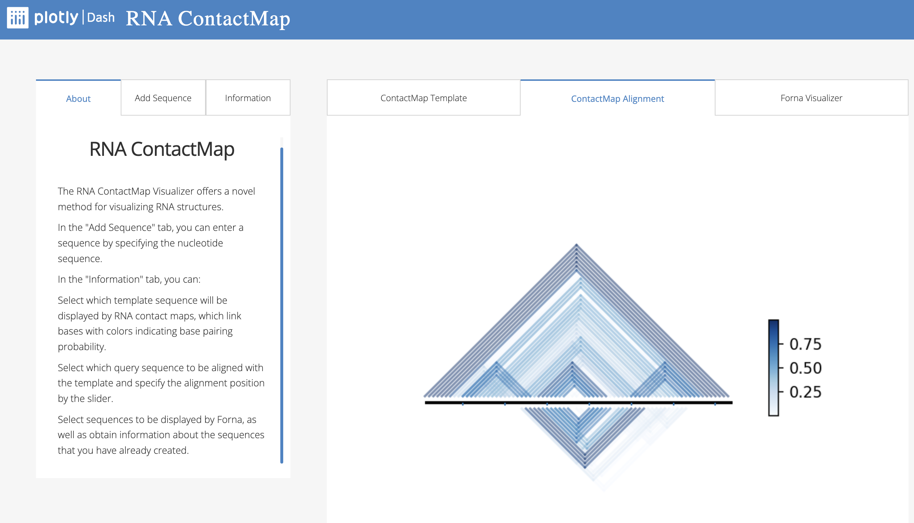
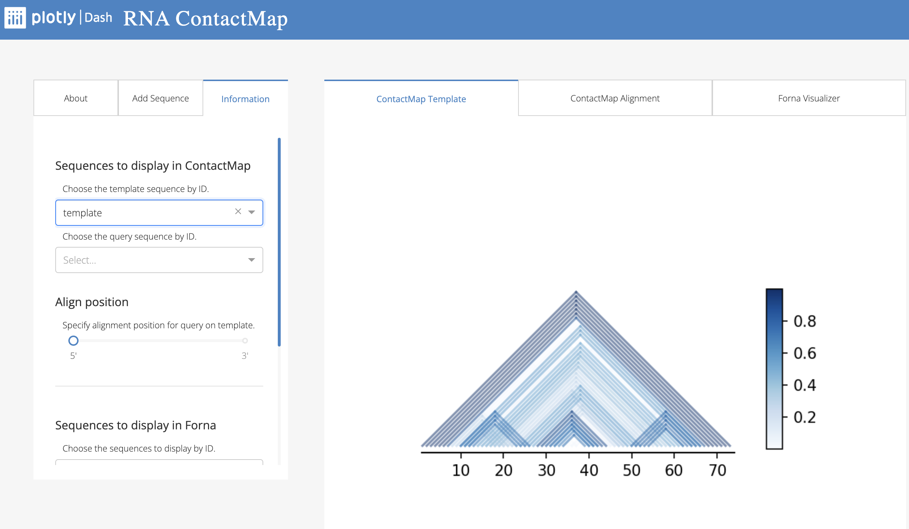
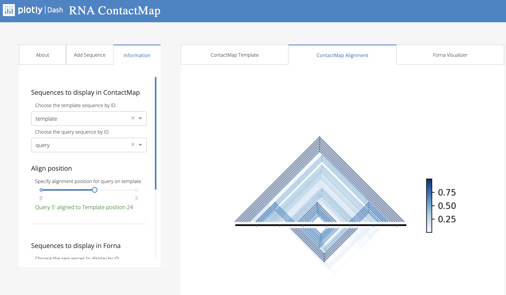
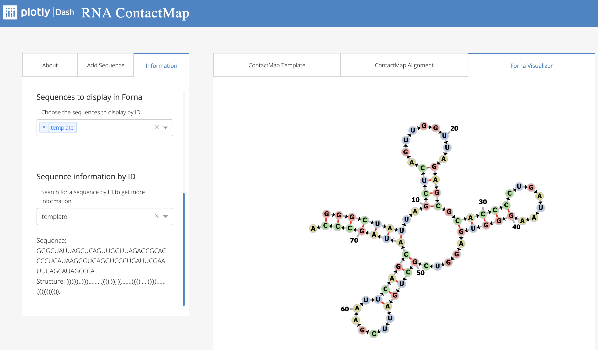

# RNA ContactMap

RNA ContactMap is a novel tool for visualizing RNA structures. It allows users to input nucleotide sequences, display contact maps with base pairing probabilities, align query sequences with templates, and visualize sequences using Forna. 



## Prerequisites

- **Conda:** Ensure that you have Conda installed on your system. You can download it from the [Anaconda website](https://conda.io/projects/conda/en/latest/user-guide/install/index.html).


## Setup and Installation

1. **Clone the Repository**

```bash
git clone https://github.com/joelbaderlab/RNAContactMap.git
cd RNAContactMap
```

2. **Create and activate conda environment**

```{bash}
# create conda environment
conda create --name dash_test --file requirements.txt --channel conda-forge --channel bioconda
# activate conda environment
conda activate dash_test
```

3. **Run the Dash app**

RNA ContactMap was implemented as a python Dash app. Run the app on localhost:

```{bash}
python app.py
```

Once the app is running, you will see a message indicating the IP address and port where the app is accessible. Typically, it will look something like this

```bash
Dash is running on http://127.0.0.1:8050/

 * Serving Flask app 'layout_helper'
 * Debug mode: on
```

Open a web browser and navigate to the provided URL to access the tool.


## Usage

### Using the app

**About Tab**

- General introduction and tutorial of RNA ContactMap

**Add Sequence Tab**

- **Enter Sequence**: Input the nucleotide sequence you want to visualize. The sequence should be a string containing only ACGTU without white space. Successful adding of sequence gives a message of "Successfully added [Sequence Name]". Longer sequence takes more time for the app to predict the secondary structure and add it into the database.

**Information Tab**

- **Select Template Sequence**: Choose the template sequence to display RNA contact maps in *ContactMap Template Tab*. The contact maps show base pairings with colors indicating base pairing probability.



- **Align Query Sequence**: Select the query sequence to align with the template. Use the slider to specify the alignment position. The overlaying contact map will be shown in *ContactMap Alignment Tab*.



- **Forna Visualization:** Select sequences to be displayed using the Forna visualization tool in *Forna Visualizer Tab*



- **Sequence details**: Access detailed information about the sequences by specifiying the sequence ID.

### Closing the App

To stop the app, return to the terminal where the app is running and press `Ctrl+C`.

